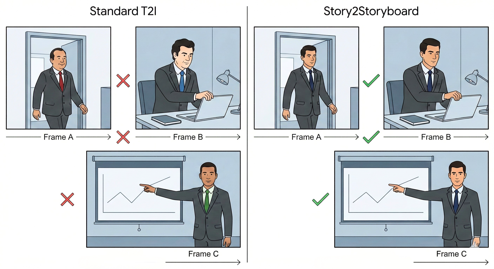
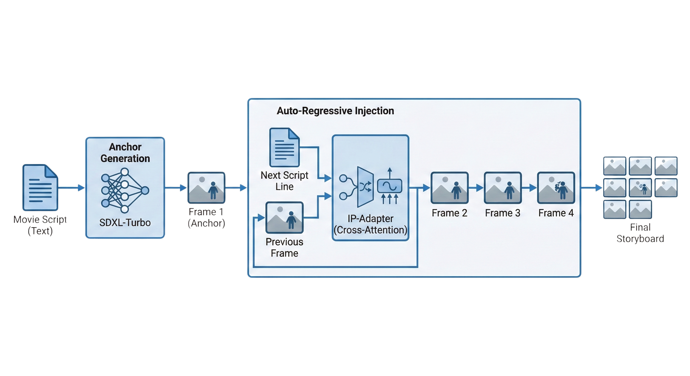
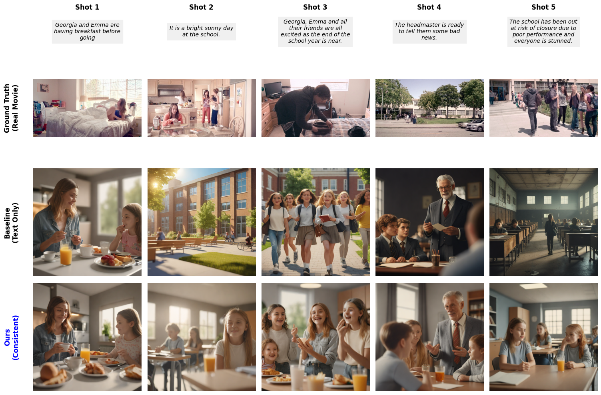

# Story2Storyboard: Consistent Visual Storyboard Generation from Text Narratives

<div align="center">


**Automatically generate visually consistent storyboards from text narratives using IP-Adapter and SDXL-Turbo**

[Paper](#) • [Dataset](#dataset) • [Installation](#installation) • [Usage](#usage)

</div>

---

## 📋 Overview

**Story2Storyboard** is a novel approach for generating consistent visual storyboards from text narratives. The system addresses the critical challenge of maintaining visual consistency (character appearance, style, and setting) across multiple frames while accurately following the narrative progression.

### Key Contributions

- 🎯 **Visual Consistency**: Achieves **+15.3% improvement** in visual consistency (CLIP-I) compared to baseline text-only generation
- ⚡ **Efficient Generation**: Leverages SDXL-Turbo for fast inference (~30x faster than standard SDXL)
- 🔄 **Memory Injection**: Uses IP-Adapter to inject visual memory from reference frames, ensuring character and style consistency
- 📊 **Comprehensive Evaluation**: Validated on VinaBench dataset with 834 test scenarios

---

## 🎬 Problem Statement

Traditional text-to-image generation models struggle with maintaining visual consistency across sequential frames. When generating storyboards from narratives, each frame is typically generated independently, leading to:

- **Character inconsistency**: Same characters appear differently across frames
- **Style drift**: Visual style changes between frames
- **Context loss**: No memory of previous frames

<div align="center">
  
  <p><em>Visualization of the consistency problem in storyboard generation</em></p>
</div>

---

## 🏗️ System Architecture

Our approach uses **IP-Adapter** to inject visual memory from the first generated frame into subsequent frames, ensuring consistency while maintaining narrative accuracy.

<div align="center">
  
  <p><em>System architecture: IP-Adapter enables visual memory injection for consistent storyboard generation</em></p>
</div>

### Methodology

1. **Reference Frame Generation**: Generate the first frame using text-only prompt (baseline SDXL-Turbo)
2. **Adapter Loading**: Load IP-Adapter weights to enable visual conditioning
3. **Consistent Frame Generation**: Generate subsequent frames by injecting the reference frame as visual memory
4. **Narrative Alignment**: Each frame follows its corresponding narrative line while maintaining visual consistency

---

## 📊 Results

### Quantitative Evaluation

We evaluate our method using two key metrics:

#### Visual Consistency (CLIP-I)
Measures the similarity between consecutive frames using CLIP image embeddings.

| Method | CLIP-I Score | Improvement |
|--------|-------------|-------------|
| **Baseline** (Text-only) | 0.6683 | - |
| **Ours** (IP-Adapter) | **0.7706** | **+15.3%** |

#### Text-Image Alignment (CLIP-T)
Measures how well generated images match their text descriptions.

| Method | CLIP-T Score |
|--------|-------------|
| **Baseline** (Text-only) | 0.2317 |
| **Ours** (IP-Adapter) | **0.2414** |

### Key Findings

- ✅ **Significant improvement** in visual consistency (+15.3%)
- ✅ **Competitive text alignment** while maintaining consistency
- ✅ **Efficient inference** with SDXL-Turbo (1-2 steps vs 30+ steps)

---

## 🖼️ Examples

### Example 1: Character Consistency

<div align="center">
  
  <p><em>Maintaining character appearance across multiple frames</em></p>
</div>

### Example 2: Narrative Progression

<div align="center">
  
  <p><em>Following narrative progression while preserving visual style</em></p>
</div>

### Example 3: Complex Scenes

<div align="center">
  
  <p><em>Handling complex multi-character scenes with consistent styling</em></p>
</div>

---

## 🚀 Installation

### Prerequisites

- Python 3.8+
- CUDA-capable GPU (recommended)
- 16GB+ RAM
- 20GB+ free disk space

### Setup

1. **Clone the repository**
```bash
git clone https://github.com/majeeedshaikh/Story2Storyboard.git
cd Story2Storyboard
```

2. **Install dependencies**
```bash
pip install torch torchvision torchaudio --index-url https://download.pytorch.org/whl/cu118
pip install diffusers transformers accelerate peft
pip install git+https://github.com/tencent-ailab/IP-Adapter.git
pip install pillow matplotlib numpy tqdm
```

3. **Download the dataset** (optional, for evaluation)
```python
from huggingface_hub import snapshot_download

local_dir = snapshot_download(
    repo_id="Silin1590/VinaBench",
    repo_type="dataset",
    allow_patterns="*.zip",
    local_dir="./VinaBench_Data"
)
```

---

## 💻 Usage

### Basic Usage

```python
import torch
from diffusers import AutoPipelineForText2Image, EulerAncestralDiscreteScheduler

# Initialize pipeline
MODEL_ID = "stabilityai/sdxl-turbo"
pipe = AutoPipelineForText2Image.from_pretrained(
    MODEL_ID,
    torch_dtype=torch.float16,
    variant="fp16"
).to("cuda")

pipe.scheduler = EulerAncestralDiscreteScheduler.from_config(
    pipe.scheduler.config,
    timestep_spacing="trailing"
)

# Generate reference frame (Frame 1)
narrative = [
    "A character enters a room",
    "They notice something unusual",
    "They investigate the object",
    "They make a discovery"
]

# Generate first frame
ref_image = pipe(
    prompt=f"cinematic shot, {narrative[0]}, photorealistic, 4k",
    num_inference_steps=2,
    guidance_scale=0.0
).images[0]

# Load IP-Adapter for consistency
pipe.load_ip_adapter(
    "h94/IP-Adapter",
    subfolder="sdxl_models",
    weight_name="ip-adapter_sdxl.bin"
)
pipe.set_ip_adapter_scale(0.5)

# Generate consistent frames
storyboard = [ref_image]
for line in narrative[1:]:
    frame = pipe(
        prompt=f"cinematic shot, {line}, photorealistic, 4k",
        ip_adapter_image=ref_image,
        num_inference_steps=2,
        guidance_scale=0.0
    ).images[0]
    storyboard.append(frame)
```

### Running the Full Pipeline

See `Story2Storyboard.ipynb` for the complete implementation including:
- Data preparation and preprocessing
- Batch generation
- Evaluation metrics calculation
- Visualization tools

---

## 📁 Dataset

We evaluate on the **VinaBench** dataset, which includes:

- **StorySalon**: 1,678 stories with 23,008 images
- **VWP (Visual Storytelling)**: 12,486 stories from movies
- **Test Set**: 834 scenarios with 4,901 images

Each story includes:
- Narrative text (script lines)
- Corresponding ground truth images
- Character profiles for consistency validation

**Dataset**: [VinaBench on Hugging Face](https://huggingface.co/datasets/Silin1590/VinaBench)

---

## 🔬 Evaluation

To reproduce the evaluation results:

```python
# Run evaluation on test set
python evaluate.py --test_json clean_test.json --output_dir evaluation_results

# Calculate metrics
python calculate_metrics.py --results_dir evaluation_results
```

Metrics calculated:
- **CLIP-I**: Visual consistency between consecutive frames
- **CLIP-T**: Text-image alignment for each frame

---

## 📄 Citation

If you find this work useful, please cite:

```bibtex
@article{story2storyboard2024,
  title={Story2Storyboard: Consistent Visual Storyboard Generation from Text Narratives},
  author={Shaikh, Abdul Majeed},
  journal={Under Review},
  year={2024}
}
```

**Note**: This paper is currently under review at a conference.

---

## 🛠️ Technical Details

### Models Used
- **Base Model**: [SDXL-Turbo](https://huggingface.co/stabilityai/sdxl-turbo) (Stability AI)
- **Adapter**: [IP-Adapter](https://github.com/tencent-ailab/IP-Adapter) (Tencent AI Lab)
- **Evaluation**: [CLIP](https://github.com/openai/CLIP) (OpenAI)

### Key Hyperparameters
- Inference steps: 2 (SDXL-Turbo)
- Guidance scale: 0.0 (SDXL-Turbo)
- IP-Adapter scale: 0.5
- Image resolution: 1024×1024

---

## 🤝 Contributing

Contributions are welcome! Please feel free to submit a Pull Request.

1. Fork the repository
2. Create your feature branch (`git checkout -b feature/AmazingFeature`)
3. Commit your changes (`git commit -m 'Add some AmazingFeature'`)
4. Push to the branch (`git push origin feature/AmazingFeature`)
5. Open a Pull Request

---

## 📝 License

This project is licensed under the MIT License - see the LICENSE file for details.

---

## 🙏 Acknowledgments

- [Stability AI](https://stability.ai/) for SDXL-Turbo
- [Tencent AI Lab](https://github.com/tencent-ailab) for IP-Adapter
- [VinaBench Dataset](https://huggingface.co/datasets/Silin1590/VinaBench) creators
- The open-source community for excellent tools and libraries

---

## 📧 Contact

For questions or inquiries, please open an issue or contact:
- **GitHub**: [@majeeedshaikh](https://github.com/majeeedshaikh)
- **Repository**: [Story2Storyboard](https://github.com/majeeedshaikh/Story2Storyboard)

---

<div align="center">

**⭐ If you find this project useful, please consider giving it a star! ⭐**

Made with ❤️ for the research community

</div>

