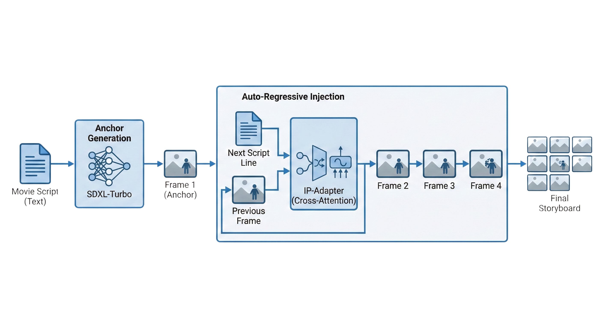
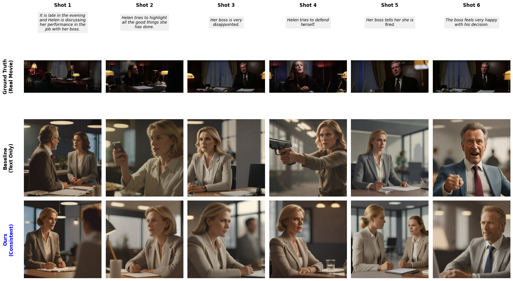
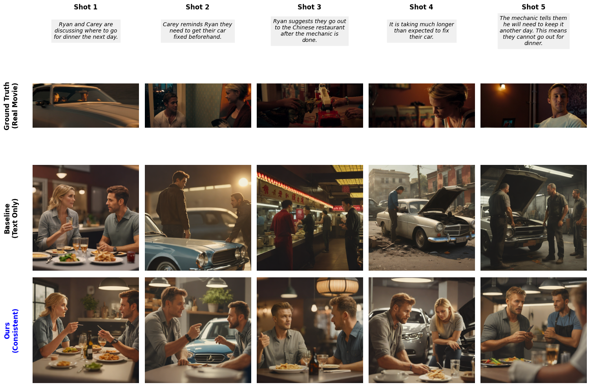

# Story2Storyboard: Consistent Visual Storyboard Generation from Text Narratives

<div align="center">


**Automatically generate visually consistent storyboards from text narratives using IP-Adapter and SDXL-Turbo**

[Paper](#) • [Dataset](#dataset) • [Installation](#installation) • [Usage](#usage)

</div>

---

## 📋 Overview

**Story2Storyboard** is a novel approach for generating consistent visual storyboards from text narratives. The system addresses the critical challenge of maintaining visual consistency (character appearance, style, and setting) across multiple frames while accurately following the narrative progression.

### Key Contributions

- 🎯 **Visual Consistency**: Achieves **+15.3% improvement** in visual consistency (CLIP-I) compared to baseline text-only generation
- ⚡ **Efficient Generation**: Leverages SDXL-Turbo for fast inference (~30x faster than standard SDXL)
- 🔄 **Memory Injection**: Uses IP-Adapter to inject visual memory from reference frames, ensuring character and style consistency
- 📊 **Comprehensive Evaluation**: Validated on VinaBench (VWP subset) with quantitative metrics

---

## 🎬 Problem Statement

Traditional text-to-image generation models struggle with maintaining visual consistency across sequential frames. When generating storyboards from narratives, each frame is typically generated independently, leading to:

- **Character inconsistency**: Same characters appear differently across frames
- **Style drift**: Visual style changes between frames
- **Context loss**: No memory of previous frames

<div align="center">
  
  <p><em>Visualization of the consistency problem in storyboard generation</em></p>
</div>

---

## 🏗️ System Architecture

Our approach uses **IP-Adapter** to inject visual memory from the first generated frame into subsequent frames, ensuring consistency while maintaining narrative accuracy.

<div align="center">
  
  <p><em>System architecture: IP-Adapter enables visual memory injection for consistent storyboard generation</em></p>
</div>

### Methodology

1. **Reference Frame Generation**: Generate the first frame using text-only prompt (baseline SDXL-Turbo)
2. **Adapter Loading**: Load IP-Adapter weights to enable visual conditioning
3. **Consistent Frame Generation**: Generate subsequent frames by injecting the reference frame as visual memory
4. **Narrative Alignment**: Each frame follows its corresponding narrative line while maintaining visual consistency

---

## 📊 Results

### Quantitative Evaluation on VinaBench (VWP Subset)

We evaluate our method on the VWP subset of VinaBench dataset using two key metrics: Visual Consistency (CLIP-I) and Text Alignment (CLIP-T). Evaluation was performed on 10 randomly sampled stories from the test set (834 total scenarios available).

| Method | Visual Consistency (CLIP-I) ↑ | Text Alignment (CLIP-T) ↑ |
|--------|-------------------------------|---------------------------|
| **Baseline (SDXL)** | 0.6683 | 0.2317 |
| **Ours (Auto-Regressive)** | **0.7706** | **0.2414** |
| **Improvement** | **+15.3%** | **+4.2%** |

### Key Findings

- ✅ **Significant improvement** in visual consistency (+15.3%)
- ✅ **Improved text alignment** (+4.2%) while maintaining consistency
- ✅ **Efficient inference** with SDXL-Turbo (1-2 steps vs 30+ steps)

---

## 🖼️ Examples

### Example 1: Character Consistency

<div align="center">
  
  <p><em>Maintaining character appearance across multiple frames</em></p>
</div>

### Example 2: Narrative Progression

<div align="center">
  
  <p><em>Following narrative progression while preserving visual style</em></p>
</div>

### Example 3: Complex Scenes

<div align="center">
  
  <p><em>Handling complex multi-character scenes with consistent styling</em></p>
</div>

---

## 🚀 Installation

### Prerequisites

- Python 3.8+
- CUDA-capable GPU (recommended)
- 16GB+ RAM
- 20GB+ free disk space

### Setup

1. **Clone the repository**
```bash
git clone https://github.com/majeeedshaikh/Story2Storyboard.git
cd Story2Storyboard
```

2. **Install dependencies**
```bash
pip install torch torchvision torchaudio --index-url https://download.pytorch.org/whl/cu118
pip install diffusers transformers accelerate peft
pip install git+https://github.com/tencent-ailab/IP-Adapter.git
pip install pillow matplotlib numpy tqdm huggingface_hub
```

**Note**: The complete working implementation is provided in `Story2Storyboard.ipynb`. The notebook includes all necessary code for data preparation, model setup, generation, and evaluation.

---

## 💻 Usage

The complete implementation is provided in `Story2Storyboard.ipynb`. The notebook contains:

1. **Data Preparation**: Download and preprocess VinaBench dataset (VWP subset)
2. **Model Setup**: Initialize SDXL-Turbo and IP-Adapter
3. **Generation Pipeline**: 
   - Baseline method (text-only generation)
   - Our method (auto-regressive with IP-Adapter)
4. **Evaluation**: Calculate CLIP-I and CLIP-T metrics
5. **Visualization**: Compare results with ground truth

### Key Implementation Details

The notebook implements the auto-regressive approach:
- Generate the first frame using text-only prompt (baseline SDXL-Turbo)
- Load IP-Adapter weights
- Generate subsequent frames by injecting the reference frame as visual memory
- Each frame follows its corresponding narrative line while maintaining visual consistency

**Note**: All code in this repository is provided as-is from the research notebook. For the exact working implementation, please refer to `Story2Storyboard.ipynb`.

---

## 📁 Dataset

We evaluate on the **VWP (Visual Storytelling)** subset of the **VinaBench** dataset:

- **VWP Test Set**: 834 scenarios with 4,901 images
- **Evaluation**: 10 randomly sampled stories from the test set
- **Source**: Movie scenes with narrative text and corresponding storyboard frames

Each story includes:
- Narrative text (script lines describing each frame)
- Corresponding ground truth images (actual movie frames)
- Character profiles for consistency validation

The full VinaBench dataset also includes:
- **StorySalon**: 1,678 stories with 23,008 images
- **VWP Train Set**: 12,486 stories from movies

**Dataset**: [VinaBench on Hugging Face](https://huggingface.co/datasets/Silin1590/VinaBench)

---

## 🔬 Evaluation

The evaluation process is implemented in `Story2Storyboard.ipynb` (Cells 22-24):

1. **Batch Generation** (Cell 22): 
   - Randomly samples 10 stories from the VWP test set
   - Generates storyboards using both baseline and our method
   - Saves results for metric calculation

2. **Metrics Calculation**:
   - **CLIP-I** (Cell 23): Visual consistency between consecutive frames using CLIP image embeddings
   - **CLIP-T** (Cell 24): Text-image alignment for each frame using CLIP text-image similarity

The evaluation results show our auto-regressive method achieves:
- **+15.3% improvement** in visual consistency (CLIP-I: 0.6683 → 0.7706)
- **+4.2% improvement** in text alignment (CLIP-T: 0.2317 → 0.2414)

---

## 📄 Citation

If you find this work useful, please cite:

```bibtex
@inproceedings{majeed2025story2storyboard,
  title={Story2Storyboard: Consistent Visual Narrative Generation via Auto-Regressive Visual Prompting},
  author={Majeed, Muhammad Abdul and Haq, Abdul Wasay Ul},
  booktitle={2025 International Conference on IT and Industrial Technologies (ICIT)},
  year={2025}
}
```

**Note**: This paper is currently under review at a conference.

---

## 🛠️ Technical Details

### Models Used
- **Base Model**: [SDXL-Turbo](https://huggingface.co/stabilityai/sdxl-turbo) (Stability AI)
- **Adapter**: [IP-Adapter](https://github.com/tencent-ailab/IP-Adapter) (Tencent AI Lab)
- **Evaluation**: [CLIP](https://github.com/openai/CLIP) (OpenAI)

### Key Hyperparameters
- Inference steps: 2 (SDXL-Turbo)
- Guidance scale: 0.0 (SDXL-Turbo)
- IP-Adapter scale: 0.5
- Image resolution: 1024×1024

---

## 🤝 Contributing

Contributions are welcome! Please feel free to submit a Pull Request.

1. Fork the repository
2. Create your feature branch (`git checkout -b feature/AmazingFeature`)
3. Commit your changes (`git commit -m 'Add some AmazingFeature'`)
4. Push to the branch (`git push origin feature/AmazingFeature`)
5. Open a Pull Request

---

## 📝 License

This project is licensed under the MIT License - see the LICENSE file for details.

---

## 🙏 Acknowledgments

- [Stability AI](https://stability.ai/) for SDXL-Turbo
- [Tencent AI Lab](https://github.com/tencent-ailab) for IP-Adapter
- [VinaBench Dataset](https://huggingface.co/datasets/Silin1590/VinaBench) creators
- The open-source community for excellent tools and libraries

---

## 📧 Contact

For questions or inquiries, please open an issue or contact:
- **GitHub**: [@majeeedshaikh](https://github.com/majeeedshaikh)
- **Repository**: [Story2Storyboard](https://github.com/majeeedshaikh/Story2Storyboard)

---

<div align="center">

**⭐ If you find this project useful, please consider giving it a star! ⭐**

Made with ❤️ for the research community

</div>

